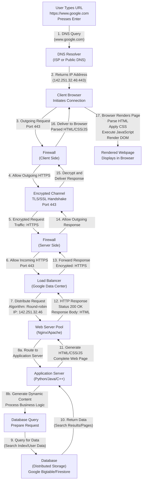

```mermaid
graph TD
    A["User Types URL<br/>https://www.google.com<br/>Presses Enter"] -->|"1. DNS Query<br/>(www.google.com)"| B["DNS Resolver<br/>(ISP or Public DNS)"]
    B -->|"2. Returns IP Address<br/>(142.251.32.46:443)"| C["Client Browser<br/>Initiates Connection"]
    C -->|"3. Outgoing Request<br/>Port 443"| D["Firewall<br/>(Client Side)"]
    D -->|"4. Allow Outgoing HTTPS"| E["Encrypted Channel<br/>TLS/SSL Handshake<br/>Port 443"]
    E -->|"5. Encrypted Request<br/>Traffic: HTTPS"| F["Firewall<br/>(Server Side)"]
    F -->|"6. Allow Incoming HTTPS<br/>Port 443"| G["Load Balancer<br/>(Google Data Center)"]
    G -->|"7. Distribute Request<br/>Algorithm: Round-robin<br/>IP: 142.251.32.46"| H["Web Server Pool<br/>(Nginx/Apache)"]
    H -->|"8a. Route to<br/>Application Server"| I["Application Server<br/>(Python/Java/C++)"]
    I -->|"8b. Generate Dynamic Content<br/>Process Business Logic"| J["Database Query<br/>Prepare Request"]
    J -->|"9. Query for Data<br/>(Search Index/User Data)"| K["Database<br/>(Distributed Storage)<br/>Google Bigtable/Firestore"]
    K -->|"10. Return Data<br/>(Search Results/Pages)"| I
    I -->|"11. Generate HTML/CSS/JS<br/>Complete Web Page"| H
    H -->|"12. HTTP Response<br/>Status 200 OK<br/>Response Body: HTML"| G
    G -->|"13. Forward Response<br/>Encrypted: HTTPS"| F
    F -->|"14. Allow Outgoing Response"| E
    E -->|"15. Decrypt and<br/>Deliver Response"| D
    D -->|"16. Deliver to Browser<br/>Parsed HTML/CSS/JS"| C
    C -->|"17. Browser Renders Page<br/>Parse HTML<br/>Apply CSS<br/>Execute JavaScript<br/>Render DOM"| L["Rendered Webpage<br/>Displays in Browser"]
```